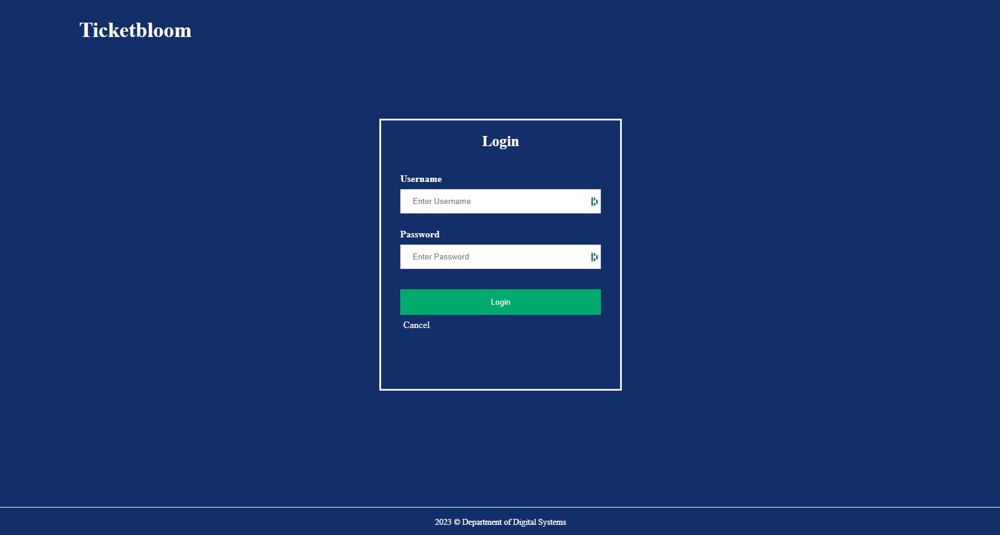

# Ticketbloom

<ol>
  <li>Download the files</li>
  <li>Open a Terminal in the directory of the project</li>
  <li>node ./server.js</li>
  <li>Open a web browser and in the url put “http://127.0.0.1:3000”</li>
</ol>
  
<h4>Default Admin</h4>
  
| Username  | Password |
| ------ | -------|
| admin  | admin |

<h4>Default User</h4>
  
| Username  | Password |
| ------ | -------|
| user0  | 12345 |
<h3> Functions</h3>
<ul>
  <li>
     <h3>Home page</h3>
      <h5>Functions: Sign in, Register, My Profile, About, Artistic Events</h5>
      </img>
  </li>
  <li>
     <h3>Sign in</h3>
      </img>
  </li>
  <li>
     <h3>Register</h3>
      </img>
  </li>
  
  <li>
     <h3>About</h3>
      </img>
  </li>
  <li>
     <h3>About</h3>
      </img>
  </li>
  <li>
     <h3>Booking History</h3>
      </img>
  </li>
  <li>
     <h3>My Profile</h3>
      </img>
  </li>
  <li>
     <h3>Artistic Events</h3>
      </img>
  </li>
  <li>
     <h3>Booking Page</h3>
      </img>
      </img>
      </img>
  </li>
  <li>
     <h3>Review Page</h3>
      </img>
  </li>
  <li>
     <h3>Edit Users</h3>
      </img>
  </li>
  <li>
     <h3>Create Event</h3>
      </img>
       </img>
  </li>
  <li>
     <h3>Edit About</h3>
      </img>
  </li>
</ul>
